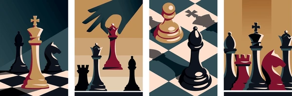

# Critical Position Analysis in the Danish Gambit  



## Table of Contents  

1. [The Problem](#the-problem)  
2. [Hypothesis](#hypothesis)  
3. [Executive Summary](#executive-summary)  
   - [Top 5 Critical Positions](#top-5-critical-positions)  
   - [Sample Games Reaching the Top Ranked Positions](#sample-games-reaching-the-top-ranked-positions)  
4. [The Dataset](#the-dataset)  
   - [Data Source](#data-source)  
   - [Filtering Process](#filtering-process)  
5. [Analysis](#analysis)  
   - [PageRank Results](#pagerank-results)  
6. [Findings](#findings)  
7. [Conclusions](#conclusions)  
8. [Future Analysis](#future-analysis)  
9. [Acknowledgments](#acknowledgments)  

---

## The Problem  
The **Danish Gambit**, a dynamic chess opening known for its pawn sacrifices to accelerate development, offers exciting and sharp positions. I faced the challenge of navigating the overwhelming number of possible variations. Identifying critical positions where decisions significantly impact the game was essential for building an effective repertoire.  

This project explores whether I can use graph-based methods to find these positions in real-world games, offering actionable insights for mastering this opening.

---

## Hypothesis  
I represented the Danish Gambit as a **directed graph**, where:  
- **Nodes** represent board positions (FEN strings).  
- **Edges** represent transitions between positions (moves).  

Using **PageRank**, I hypothesized that I could identify the most critical positions in the graph—those frequently encountered and highly influential in determining game outcomes.  

---

## Executive Summary  

This study identifies critical positions in the Danish Gambit to enhance strategic preparation. By applying PageRank to a graph of chess positions, the analysis highlights pivotal moments that significantly affect game outcomes.  

### Key Insights  
- **Critical Transition Points**: Positions between **moves 8–10** are the most influential, marking tactical complications.  
- **Actionable Preparation**: The identified positions are essential for mastering the Danish Gambit at higher skill levels.

---

### Top 5 Critical Positions  

| **Rank** | **FEN**                                              | **Evaluation** | **Key Features**                                                                                 |  
|----------|------------------------------------------------------|----------------|--------------------------------------------------------------------------------------------------|  
| **1**    | `rnbq1rk1/pppp1ppp/8/4P3/2B1Q3/2P5/P4PPP/R1B1K1NR b KQ - 0 9` | +4.9 | White dominates the center with the queen and bishop, applying pressure on Black's position.    |  
| **2**    | `rnbqk1nr/pppp1ppp/8/8/4P3/2Q5/PP3PPP/R1B1KBNR b KQkq - 0 6`  | -0.2 | White’s early queen development creates a central advantage. Black must counter White’s setup.  |  
| **3**    | `r1b1kb1r/ppp1qpp1/2np3p/3n4/2B1P3/1Q3N2/PP3PPP/R1B2RK1 w kq - 0 10` | +2.2 | Tactical complexity with both sides having active pieces.                                       |  
| **4**    | `r1bq1rk1/ppp1npp1/2np3p/6NQ/2B1P3/2P5/P4PPP/R1B2RK1 w - - 0 11` | +4.1 | White’s queen and knight threaten Black’s kingside. Black must defend accurately.               |  
| **5**    | `r1b2rk1/ppp1qppp/3p1n2/4N1B1/2B1P3/1QP5/P4PPP/R3R1K1 b - - 0 12` | -0.6 | White dominates the board with active pieces, putting Black under significant pressure.          |  

---

### Sample Games Reaching the Top Ranked Positions  

Below are examples of games leading to the **top 3 critical positions** in the analysis. Each game is visualized with a GIF.  

#### **Top Ranked Position**  
  

#### **Second Ranked Position**  
  

#### **Third Ranked Position**  
  

---

## The Dataset  

### Data Source  
I used the **Lichess Open Database**, which provides `.pgn` files containing millions of games. I filtered the games to include only those reaching a critical Danish Gambit position:  

```
rnbqkbnr/pppp1ppp/8/8/4P3/2N5/PP3PPP/R1BQKBNR b KQkq - 0 1
```

### Filtering Process  
Using **pgn-extract**, I isolated games containing this position with Black to move. The dataset was reduced to a manageable size, ensuring a focused analysis.

---

## Analysis  
The dataset was processed into a directed graph of FEN positions. **Edge weights** were calculated based on transition probabilities, creating a **stochastic matrix** for PageRank analysis.

### PageRank Results  
The PageRank algorithm ranked positions based on their recurrence and influence. I analyzed the top-ranked positions for tactical and strategic importance.

---

## Findings  

1. **Key Positions**: Moves 8–10 emerged as the most critical phase, aligning with the tactical nature of the Danish Gambit.  
2. **Practical Relevance**: Understanding top-ranked positions improves preparedness for competitive play.  

---

## Conclusions  
This analysis highlights the value of graph-based methods for studying chess openings. By identifying critical positions, I can focus my preparation on the most impactful moments, gaining a competitive edge.

---

## Future Analysis  

- **Exploring Other Openings**: Extending this methodology to other chess openings.  
- **Player Ratings**: Analyzing patterns based on skill levels.  
- **Outcome Analysis**: Correlating critical positions with game outcomes.  
- **Machine Learning**: Predicting opponent responses based on position.  

---

## Acknowledgments  
- **[pgn-extract](https://www.cs.kent.ac.uk/people/staff/djb/pgn-extract/)**: Essential for filtering and processing `.pgn` files.  
- **[Lichess Open Database](https://database.lichess.org/)**: Source of game data.  
- **[Chess.com GIF Maker](https://www.chess.com/gifs)**: For creating visual representations of positions.  

---  

Feel free to contribute by opening issues or submitting pull requests!  
